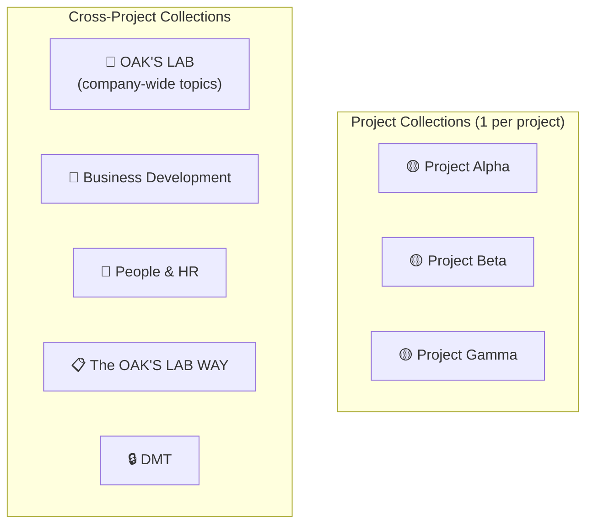
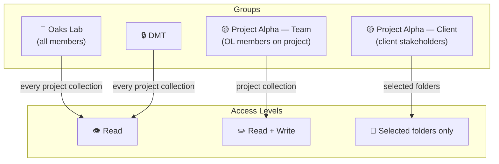

> **Status:** For exec review — go/no-go decision | **Author:** @[Tonda Kmoch](mention://user/ca0de915-7725-4b57-913c-24a1f2fadc10) | **Last updated:** 2026-05-19

> **TL;DR**
>
> We are asking the leadership team to approve the migration of OAK'S LAB documentation from **Atlassian Confluence (SaaS)** to **Outline, self-hosted by us on GCP, running on the open-source edition**. This is the master signpost for the decision: it consolidates *why* we want this, *how* we will operate, *what* it costs, *what* we lose by going open-source, *what risks* we accept, and *when* the migration will happen.
>
> **What we want decided tomorrow:** (1) approval to move forward end-to-end with the migration; (2) approval to run the **open-source** edition rather than the paid Business licence; (3) acknowledgement of the privacy trade-off introduced by self-hosting; (4) sign-off on the phased migration plan and timeline (3 phases over \~3 weeks).

---

## 1. Why Outline (vs Confluence)

### 1.1 The strategic case — Outline fits an AI-first operating model

The single most important reason for the move is that **Outline is structurally compatible with how we now work, and Confluence is not**. Our methodology and day-to-day operations are shifting from human-read documentation to AI-consumed context (see [DMT Vision: AI-First Operations](/doc/dmt-vision-ai-first-operations-e9PKZMwV1w)). The system that holds our knowledge has to be readable, writable, and queryable by AI agents — not just by humans.

| Capability | Confluence | Outline |
|---|---|---|
| **Storage format** | Proprietary XHTML (Atlassian Document Format) | Native Markdown — the format every modern AI tool already speaks |
| **API for AI agents** | Limited; Confluence cloud API is rate-limited and ADF-shaped | First-class REST API; works directly with Claude Code / MCP |
| **MCP integration** | None | Outline ships an official MCP server; AI reads/writes documents directly |
| **Structured context for project work** | Not enforceable | Standard collection template — every project looks the same to AI |
| **Self-hostable for compliance** | Server tier discontinued; cloud-only for most customers | Yes — fully self-hostable, including open-source edition |

This compounding effect — every project getting smarter because every other project's context is structured the same way and accessible to AI — is the actual reason we are moving. Confluence cannot be retrofitted to deliver this; we have tried.

### 1.2 The operational case — Outline is simply a better wiki

Independent of AI, the broader industry trend is teams leaving Confluence for Outline (and similar lightweight wikis). The recurring reasons mirror our own experience:

* **Speed and UX** — Confluence is widely described as sluggish and cluttered. Outline is fast, opinionated, and stays out of the way.
* **Real-time collaboration** — Outline edits live, like Google Docs. Confluence still produces edit conflicts.
* **Simpler permissions** — Outline uses straightforward group-based permissions on collections. Confluence's permission model is famously hard to reason about.
* **Markdown-first editor** — slash commands, shortcuts, no Atlassian-flavoured WYSIWYG quirks.
* **Backlinks and search** — bidirectional links via `@` and millisecond search out of the box.
* **Hosting flexibility** — self-hosting is a first-class option in Outline; on Atlassian it requires Data Center / Enterprise pricing.
* **Cost trajectory** — Atlassian has been ending Server, pushing to Cloud/Data Center, and raising prices year over year.

In short: even without the AI argument, Outline is the wiki we would build for ourselves if we were starting from scratch today.

---

## 2. Why Now & The Decision Being Asked

### 2.1 Why now

* We have already validated Outline on three live projects through the SaaS Cloud instance — the operating model works.
* @[Jan Barta](mention://user/3d44822d-6b6c-4940-b5fd-0247c72d79d6) has stood up a working self-hosted instance on our GCP infrastructure. The technical risk is no longer hypothetical.
* Confluence cloud does not clear our ISO 27001 / client data confidentiality bar for hosting our entire knowledge base going forward (confirmed in our 2026-04-20 call with Tom Moor, Outline). Self-hosting is the standard path used by other compliance-sensitive orgs.
* AI-first workflows are landing across projects *now*. Every week we run on Confluence is a week of compounding mis-fit.

### 2.2 The decision

| # | We are asking the execs to approve | Why it needs an exec call |
|---|---|---|
| 1 | **Migrate the full company off Confluence to self-hosted Outline** | Affects 100+ users, multiple clients, ISO scope, contracts |
| 2 | **Run on the open-source edition, not the paid Business licence** | Removes a recurring licence cost but loses a defined feature set — exec must confirm we accept the trade-offs in §4 |
| 3 | **Accept the self-hosting privacy trade-off** | The CTO will, by virtue of running the infra, have technical read access to all content (§5). Confluence cloud does not have this property. Execs must accept this consciously. |
| 4 | **Phased migration with the published timeline** | Touches every team and many clients; we need leadership air cover for the migration window |

---

## 3. Pricing & Licensing

### 3.1 Current Confluence spend

> @[Andy Powell](mention://user/612827bb-3c41-47aa-ac34-ed1cecf30bbe) is finalising the exact numbers — see [Outline Self-Hosting: Security & Billing Investigation](/doc/outline-self-hosting-security-billing-investigation-QhPDrFAwt1). Inputs being collected:

* Current Confluence licence tier (Standard / Premium / Enterprise)
* Current paid seat count and monthly / annual spend
* Confluence renewal date (natural off-ramp?)
* Any Atlassian Marketplace add-on costs

Target output is a single CFO-readable line: *"Confluence today = $X/year for Y users. Outline self-hosted (OSS) = $Z/year for Y users, infra all-in."*

### 3.2 Outline self-hosted pricing

| Option | Per-user licence | Notes |
|---|---|---|
| **Open-source edition** *(our chosen path)* | **$0** | License under BSL; full source on GitHub; no per-user fee |
| Business licence (on-prem) | $4 / user / month | Adds SAML, audit log, structured data attributes, Confluence importer, guest users |
| Enterprise licence (on-prem) | $5 / user / month | Business + 24h support SLA |

For reference at our scale (≈150 users at full rollout):

| Tier | Monthly | Annualised |
|---|---|---|
| **Open-source (chosen)** | **$0 licence + infra only** | **~$1–3k/year infra** |
| Business | $600 + infra | $7,200 + infra |
| Enterprise | $750 + infra | $9,000 + infra |

### 3.3 Infrastructure cost (self-hosting on GCP)

Per @[Jan Barta](mention://user/3d44822d-6b6c-4940-b5fd-0247c72d79d6)'s technical assessment (see [Outline On-Premises Hosting — Technical Assessment](/doc/outline-on-premises-hosting-technical-assessment-gXfWOxv5Zl)):

| Architecture | Approx. monthly cost | Trade-off |
|---|---|---|
| Single VM (bare-metal / `e2-standard-4`) | ~$40–$150 | Cheapest, more maintenance |
| GCP managed services (Compute Engine + Cloud SQL + Memorystore + GCS) | ~$140–$205 | Most secure, lowest day-2 ops overhead — **recommended** |

**Bottom line:** running open-source self-hosted Outline on GCP costs us roughly **one to two thousand dollars per year in infra**, with **zero per-user licence fees**, compared to several thousand to several tens of thousands per year on Confluence.

---

## 4. Open-Source vs Business Licence — Feature Delta

By choosing the open-source edition we forgo certain features that exist in the paid Business / Enterprise licence. This is the most important section for the exec discussion: **we need to consciously sign off that we can live without each of these.**

| Feature missing in OSS | What it does | Why we believe we don't need it |
|---|---|---|
| **SAML SSO** | Enterprise SAML 2.0 with Okta / OneLogin / Active Directory | We will use **Google OAuth** instead — fully supported in OSS, matches our existing Google Workspace identity. SAML is only needed if we ever switch IdP, which we have no plan to do. |
| **Security audit log** | Log of every user action and admin change | We get most of this via **GCP-level audit logs** (who logged in, when, from where) and Outline's built-in document version history. We will add Outline application logs to our existing GCP logging. Not loss of capability — just a different surface. |
| **Guest accounts** | Per-document or per-collection invites for people who are not paid seat-holders | This is the one capability that genuinely changes how we operate. **All access for clients will be controlled via groups**, not per-document guest invites. See §7. We will need group hygiene discipline, especially on the "Oaks Lab" group, to avoid accidental exposure. |
| **Confluence importer** | Built-in importer that ingests an exported Confluence space | Not blocking. We can (a) **migrate only living documents manually or via script**, and (b) we have already started running the open-source [confluence-to-markdown](https://github.com/) conversion path. Volume is small enough that manual + scripted import is feasible. |
| **Structured data attributes** | Custom metadata fields on documents (e.g. status, owner, due date) | We don't depend on this today. If we ever need it, we encode it in the document body (frontmatter or a small table at the top). |
| **24h support SLA (Enterprise only)** | Outline support responds within 24 hours | Outline is open-source — if we hit a serious bug we have the source. Honza's team owns the deployment. We accept community support as the default. |

**Decision implied:** we go OSS. We revisit only if (a) we hit a hard requirement that we genuinely can't work around, or (b) the cost of group-hygiene mistakes ever exceeds the licence cost.

---

## 5. Risk: Self-Hosting Means We Can Technically Read Private Content

This is the most important risk to surface for execs because it has no clean technical fix — only a governance answer.

**Today (Confluence cloud):** even our CEO cannot read someone's private Confluence content. Atlassian operates the platform; their internal access controls and SOC certifications govern that boundary.

**Tomorrow (self-hosted Outline):** the engineers operating the GCP project — in practice @[Jan Barta](mention://user/3d44822d-6b6c-4940-b5fd-0247c72d79d6) (CTO) and anyone with admin on the database — can technically read any document, including private ones. This is true of every self-hosted wiki, not specific to Outline.

**What we propose:**

| Mitigation | Description |
|---|---|
| **Make this explicit, not implicit** | Add to internal policy: "OAK'S LAB hosts its own Outline instance. Operations staff with database access have technical access to all content. We treat that access under the same NDA and ISO 27001 controls as any other administrator role." Communicate to staff before migration. |
| **Minimise admin privileges** | Only the named DRI and one backup hold database/admin credentials. All access is logged. |
| **Honest scope** | Documents that *must* never be readable by Oaks Lab operations staff (e.g. employee salary review notes, M&A discussions) **do not live in Outline**, full stop. They live in Google Workspace with Workspace-level access controls. |
| **Client-side optional control** | For unusually sensitive client engagements we can offer the client a separate self-hosted instance on infrastructure they control. This is an exception path, not the default. |

**The exec ask in this section:** acknowledge and accept this trade-off in writing. If it is not acceptable, the migration cannot proceed.

---

## 6. Working in Outline — Collection Structure

Every project gets its own collection. Cross-project activities get shared collections.



### 6.1 Standard project collection template

Every project collection follows this fixed structure:

```
📁 [Project Name]
├── 📄 Project Brief                ← agreed 14-section template (originally called A4)
├── 📁 Meetings                     ← transcripts from Gemini/Granola
│   ├── 📁 Stakeholder Meetings        ← shared with client group
│   └── 📁 Internal Meetings
├── 📁 Product                      ← roadmap, specs, user research  → shared with client group
├── 📁 Engineering                  ← architecture, ADRs, tech debt
├── 📁 Design                       ← design decisions, brand assets → shared with client group
├── 📁 QA                           ← test strategy, test plans
└── 📁 Management                   ← reporting, SOW, stakeholder alignment (internal)
```

**Rules:**

* **Project Brief** is always the first document — it's the entry point for both humans and AI.
* **Project Brief** follows the agreed 14-section template (see OLH Intake Project Brief as reference).
* `Meetings/` receives automated transcripts — see [Meeting Intelligence Pipeline](/doc/e8ac76b0-c3a2-4c0b-9713-4b20d5c949db).
* Every folder can have sub-documents — the top-level structure is fixed.
* **Folders marked "shared with client group" are the only paths a client ever sees.** Everything else stays Oaks-Lab-internal.

---

## 7. Permissions Model



### 7.1 Operating principles (non-negotiable)

These principles exist because we are on the open-source edition without guest accounts, and because the cost of an accidental exposure to a client is high.

1. **Users cannot create collections themselves.** Only the Outline admin (proposed: Misha) creates collections. This prevents anyone from accidentally creating a collection that is open to the wrong audience.
2. **No collection is ever shared with "All members" by default.** When the admin creates a new collection, it starts with **no access**, and then *specific groups* are added explicitly. We never use the "share with the whole instance" option, because the instance contains client users.
3. **All client access is group-controlled, not per-document.** Because we don't have guest accounts on OSS, every client stakeholder is a full member of a `[Project] — Client` group with access to only the folders we intend.
4. **Client folders are sub-folders, not top-level.** The client group is granted access to `Product/`, `Design/`, `Meetings/Stakeholder Meetings/` — never to the top-level collection.
5. **DMT always has read access to every project collection** — that's how DMT does Foundation reviews, health checks, and cross-project oversight.

### 7.2 Permission rules

| Rule | Detail |
|------|--------|
| **Default Outline role** | All Oaks Lab members are created as **Editors**. All external clients are created as **Members** with no global access (groups grant access). |
| **New collection default** | **No access** — explicitly configured per collection. |
| **`Oaks Lab` group** | Read access to every project collection. |
| **`DMT` group** | Read access to every project collection (plus full access to the DMT collection). |
| **`[Project] — Team`** | Read + Write (or Manage) on their project collection. |
| **`[Project] — Client`** | Access to **selected folders only** (e.g. `Product/`, `Design/`, `Meetings/Stakeholder Meetings/`). **Never to the whole collection.** |
| **`DMT` collection** | Restricted to DMT members only. |

### 7.3 Group naming convention

| Group | Example |
|-------|---------|
| Company-wide | `Oaks Lab` |
| Project team (internal) | `[Project Name] — Team` |
| Project client | `[Project Name] — Client` |
| Cross-functional | `DMT`, `Engineering Leads`, etc. |

### 7.4 Group admin

We propose **Misha (@[Michal Strapaty](mention://user/210155a5-5e0a-4162-b65f-b13e822f59b1))** as the Outline admin who owns collection creation and group membership. One person owning this prevents drift and accidental exposure.

#### Correct setup of permissions


---

## 8. Hosting & Infrastructure

> This chapter is intentionally a stub. The detailed answers belong in [Outline On-Premises Hosting — Technical Assessment](/doc/outline-on-premises-hosting-technical-assessment-gXfWOxv5Zl), owned by @[Jan Barta](mention://user/3d44822d-6b6c-4940-b5fd-0247c72d79d6).

The execs need confidence that the operational picture is mapped — not the picture itself. The following questions are the ones we are asking @[Jan Barta](mention://user/3d44822d-6b6c-4940-b5fd-0247c72d79d6) to answer in the child doc above:

1. **Where exactly does Outline run** — which GCP project, which region, what's the topology (Compute Engine + Cloud SQL + Memorystore + GCS, or a single VM)?
2. **Who is the DRI** for the running service, and who is the named backup?
3. **What is the upgrade cadence** — Outline ships often; how do we keep up safely?
4. **What is our backup policy** — frequency, destination, retention, encryption at rest?
5. **Restore testing** — how often do we actually rehearse a restore, and how do we verify integrity?
6. **Disaster-recovery RPO/RTO** — what loss and what downtime are we willing to accept, and does the architecture meet that?
7. **Network posture** — is the instance public + SSO-gated, or behind a VPN? What's the TLS / certificate story?
8. **Authentication** — Google OAuth via Workspace, mapped to which roles, with what de-provisioning trigger?
9. **Monitoring and alerting** — who gets paged when it goes down, and against which SLOs?
10. **Patch and CVE response** — how fast do we patch a critical CVE in Outline or its dependencies, and who runs that?

---

## 9. Migration Plan & Phasing

We migrate in three phases. Each phase has a deliberately small scope so that we can validate the next step before committing the company.

### 9.1 Phase 1 — Pilot on the self-hosted instance (~1 week)

**Scope:** the two projects that are already on the Outline SaaS Cloud — **OLH Intake** and **OLH RCM**. We move them off SaaS Cloud and onto our self-hosted GCP instance.

**Goal:** validate that the self-hosted deployment works end-to-end with real, day-to-day project usage — including AI/MCP access, group permissions, and meeting transcript ingestion.

**Exit criteria:** both project teams report normal workflows for one full week with no operational issues; backup/restore validated at least once.

### 9.2 Phase 2 — Non-living Confluence projects (~1 week)

**Scope:** projects that exist in Confluence but are **not** day-to-day changing — for example **The OAK'S LAB WAY**, **Narwhal**, **Swiftly**.

**Goal:** validate the Confluence → Outline migration *mechanics* (export, conversion, import, link integrity) on real content without risk to live work.

**Exit criteria:** all migrated content is readable and well-formed in Outline; structure matches the project template; AI/MCP can query it.

### 9.3 Phase 3 — Cutover for all living documents

**Scope:** on cutover day, everything that is a **living document** moves — whether it currently sits on Outline SaaS Cloud or in Confluence. From that moment, Outline self-hosted is the source of truth.

**Exception — Reservoir:** the Reservoir project plans to complete in Confluence. We leave Reservoir users on Confluence until the project finishes, then migrate the Reservoir space to Outline so we end with everything in Outline.

### 9.4 What stays in Confluence after Phase 3

Per [Identification of CNF Spaces we need to migrate](/doc/c2c85304-9648-4e71-896f-19d8cf073c0e):

* Completed / archived project spaces stay in Confluence as legacy storage.
* Only a small number of named people retain Confluence access for legacy retrieval.
* ~90% of users are removed from Confluence at cutover.
* Confluence becomes effectively read-only for the few who still need it.

### 9.5 Migration scope — what migrates and what doesn't

| Item | Migrates? | Notes |
|---|---|---|
| **Documents and collections** | Yes | Living documents only; legacy stays in Confluence |
| **Document version history** | Partial | Most recent revisions; full history not preserved |
| **Comments and discussions** | **No** | Cloud-to-self-host transfer does not preserve comments. Flag to teams: pre-migration discussions are read-only in the old location. |
| **Users** | No | Re-invited via Google SSO into the self-hosted instance |
| **Integrations** | No | Slack / Claude Code / MCP / other integrations are rebuilt against the new instance |
| **Attachments / images** | Yes | Migrated alongside documents where possible |

### 9.6 Per-project migration checklist

- [ ] Project identified for migration in the [tracker](/doc/c2c85304-9648-4e71-896f-19d8cf073c0e)
- [ ] Collection created in Outline with the standard structure
- [ ] Permission groups created (Team + Client)
- [ ] Project Brief created or migrated
- [ ] Living documents identified and migrated
- [ ] Meeting transcripts pipeline configured (see Meeting Intelligence doc)
- [ ] Team notified of new Outline location
- [ ] Client invited to the `Client` group (if applicable)
- [ ] Old Confluence space marked as archived / read-only
- [ ] Verified: AI can access project context via MCP

### 9.7 Migration priority

| Priority | Projects | Criteria |
|---|---|---|
| **P1 — Immediate** | Projects already using AI / Claude Code | Highest benefit from structured Outline |
| **P2 — Next** | Active projects with engaged stakeholders | Get client collaboration benefits |
| **P3 — Later** | Projects in maintenance / support phase | Lower urgency, migrate when convenient |
| **No migration** | Completed / archived projects | Stay in Confluence as legacy |

---

## 10. Other Risks & Open Items

| Risk | What it is | How we mitigate |
|---|---|---|
| **Comments and integrations don't migrate** | Discussion threads in Confluence (and on SaaS Outline) won't carry over. Slack/MCP/Claude Code integrations must be rebuilt. | Communicate to teams ahead of time; rebuild integrations during the pilot phase; treat pre-migration discussions as historical. |
| **Day-2 ops** | The "<2 hours/month to maintain" estimate assumes nothing goes wrong. Budget for the first bad upgrade. | Named DRI, staging environment, and a documented rollback plan before any production upgrade. |
| **Group hygiene** | Because we have no guest accounts, a single mis-configured group could expose internal content to a client. | One named admin (Misha), all new collections default to no-access, monthly audit of group memberships, every change reviewed. |
| **Training and change management** | 100+ users learning a new tool; some Confluence muscle memory will need un-learning. | Short onboarding doc (one page) + a live walk-through per team during their migration window. |
| **Client perception** | Some clients may ask "why are you changing where our docs live?" | Brief talking-points doc for PMs to send to clients in advance, framing it as a security and AI-capability upgrade. |
| **Confluence renewal timing** | If we don't migrate before the renewal date, we re-up a contract we don't need. | Andy's billing investigation is tracking renewal date; migration plan aligned to it. |

---

## 11. Decision Asks for Execs

The execs are being asked to approve the following in tomorrow's meeting:

| # | Decision | Owner from leadership for the call |
|---|---|---|
| 1 | **Approve migration from Confluence to self-hosted Outline as the company-wide direction.** | Jake / Andy |
| 2 | **Approve running the open-source edition (not the paid Business licence).** Acknowledge the feature trade-offs in §4. | Jake / Andy / Jan |
| 3 | **Acknowledge and accept the self-hosting privacy trade-off (§5).** Operations staff with DB access can technically read any document. | Jake / Andy |
| 4 | **Approve the phased migration plan (§9) and the ~3-week window.** | Jake / Andy / Tonda |
| 5 | **Confirm Jan as hosting DRI and Misha as Outline admin (group/collection owner).** | Jake / Andy / Jan |
| 6 | **Confirm that 90% of users will lose Confluence access at cutover** and the legacy-access list. | Andy |

---

## 12. Discussion Questions for the Exec Meeting

These are the questions we expect to debate live tomorrow, in priority order:

1. **The privacy trade-off (§5)** — are we comfortable with the fact that, under self-hosting, our CTO and DB admins have technical read access to all content? If not, what's the alternative? (This is the question most likely to derail the decision; we should open with it.)
2. **OSS vs Business licence (§4)** — do we accept losing SAML / audit log / guest accounts / Confluence importer in exchange for ~$7k–$9k/year saved at our scale, plus the philosophical preference for open source?
3. **Group hygiene risk (§7, §10)** — without guest accounts, every client is a full member of a group. Are we confident in our ability to maintain group hygiene at scale, and is one named admin (Misha) enough?
4. **Migration window** — is the proposed 3-week phased timeline (1 week pilot + 1 week non-living + cutover) realistic given the projects in flight?
5. **Reservoir exception** — confirmed acceptable to leave Reservoir on Confluence until project completion?
6. **Client communication** — who owns the client-facing message, when does it go out, and what does it say?
7. **What does success look like 60 days after cutover?** What metric tells us this migration worked? (Suggested: 100% of active projects on Outline, zero accidental exposures, AI-context retrievable for every active project.)

---

## Related documents

* [DMT Vision: AI-First Operations](/doc/dmt-vision-ai-first-operations-e9PKZMwV1w) — parent vision
* [Outline Self-Hosting: Security & Billing Investigation](/doc/outline-self-hosting-security-billing-investigation-QhPDrFAwt1) — owned by Andy
* [Outline On-Premises Hosting — Technical Assessment](/doc/outline-on-premises-hosting-technical-assessment-gXfWOxv5Zl) — owned by Jan
* [Identification of CNF Spaces we need to migrate](/doc/c2c85304-9648-4e71-896f-19d8cf073c0e) — migration tracker
* [Meeting Intelligence Pipeline](/doc/meeting-intelligence-pipeline-hXloRPcmah)
* [AI Knowledge Architecture](/doc/ai-knowledge-architecture-k4tvpI7UTG)
