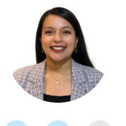

# OpenLoop Health — Org Structure

> **Source:** 13 Google Contacts directory screenshots captured **2026-05-27** (`olh_org_structure/`).  
> **Generated:** 2026-05-27 by `build_org.py` (edit that file and re-run to regenerate).  
> **Coverage:** 72 people across 7 real headshots; everyone else uses an initials avatar.

## How to use this file

This Markdown is the **source of truth**. Other outputs are generated from the same dataset:

- `olh-org-structure.html` — interactive, collapsible org chart with photos.
- `photos/` — cropped headshots for the people whose profile page had a real photo.
- The structured tree lives in `build_org.py` (`ORG`); the sections below mirror it.

## Caveats & data notes

- **Christian Williams** is the top of the *captured* tree; his own title is not shown in the source (his avatar is the OpenLoop logo, not a headshot).
- **Curtis Olson** leads an engineering/product group, but **his reporting line up the chain is not captured** — his profile shows no manager and he is not among Shaun Wei's reports. He is shown as a separate branch flagged ⚠️.
- Only profile pages that were screenshotted expose their direct reports; people without their own screenshot appear as leaves even if they may manage others.
- Titles and names are transcribed verbatim from the screenshots.

## Org chart (Mermaid)

> Shaun Wei's 30 reports are collapsed into a single node here for readability; their names are in the roster table and the interactive HTML.

```mermaid
flowchart TD
    n0["<b>Christian Williams</b><br/>Top of captured org"]
    n0 --> n1
    n0 --> n2
    n0 --> n3
    n0 --> n4
    n0 --> n5
    n0 --> n6
    n0 --> n7
    n1["<b>Diego Rodriguez</b><br/>Director, Technical Program Management & GM Perú"]
    n1 --> n8
    n1 --> n9
    n8["<b>Daniel Moncada</b><br/>Senior Technical Program Manager"]
    n9["<b>Ramesh Peesapaty</b><br/>Staff Technical Program Manager"]
    n2["<b>Gabriel Alizaidy</b><br/>Director, New Product Formulation and Rollout"]
    n3["<b>Jake Rzeszutko</b><br/>Director, Supply Chain"]
    n3 --> n10
    n3 --> n11
    n3 --> n12
    n10["<b>Denea Shelton</b><br/>Supply Chain Specialist"]
    n11["<b>Luciana Teles</b><br/>Manager, Supply Chain"]
    n12["<b>Marcial Saldana</b><br/>Sr. Supply Chain Specialist"]
    n4["<b>Kate Hainsworth</b><br/>VP, Enterprise Operations"]
    n5["<b>Ryan Cantera</b><br/>Chief of Staff (COO)"]
    n6["<b>Scott Heldt</b><br/>VP, Customer Solutions & Implementation"]
    n6 --> n13
    n6 --> n14
    n6 --> n15
    n13["<b>Katie Dave</b><br/>Director of Programs"]
    n14["<b>Mitchell Barish</b><br/>Sr. Director, Implementation"]
    n14 --> n16
    n14 --> n17
    n14 --> n18
    n14 --> n19
    n14 --> n20
    n16["<b>Faith Williams</b><br/>Implementation Project Manager"]
    n17["<b>Nirupa Parmhans</b><br/>Implementation Manager II"]
    n18["<b>Pamela Suarez</b><br/>Sr. Manager, Client Implementations"]
    n18 --> n21
    n18 --> n22
    n18 --> n23
    n18 --> n24
    n18 --> n25
    n21["<b>Aastha Patel</b><br/>Implementation Manager II"]
    n22["<b>Anisha Shukla</b><br/>Manager, Implementation"]
    n23["<b>Joe Millones</b><br/>Manager, Implementation"]
    n24["<b>Seevieta Biswas</b><br/>Manager, Implementation"]
    n24 --> n26
    n24 --> n27
    n26["<b>Johna Davis</b><br/>Senior Implementation Manager"]
    n27["<b>Shannon Falter</b><br/>Implementation Manager"]
    n25["<b>Surjt Kumar</b><br/>Sr. Implementation Manager"]
    n19["<b>Russell Nicholson</b><br/>Senior Manager, Implementation"]
    n20["<b>Winter Valent</b><br/>Implementation Manager II"]
    n15["<b>Susan Trinh</b><br/>Director, Solutions Engineering"]
    n7["<b>Shaun Wei</b><br/>EVP, Engineering"]
    n28["30 engineers & PMs<br/><i>see roster table</i>"]
    n7 --> n28
    n29["⚠️ <b>Curtis Olson</b><br/>Engineering leadership"]
    n29 --> n30
    n29 --> n31
    n29 --> n32
    n29 --> n33
    n29 --> n34
    n29 --> n35
    n29 --> n36
    n29 --> n37
    n30["<b>Alex Nima</b><br/>Director, Engineering"]
    n31["<b>Ben Routson</b><br/>Principal Software Engineer"]
    n32["<b>Chris Robot</b><br/>Staff Software Engineer"]
    n33["<b>Clint Johnson</b><br/>Principal Software Engineer"]
    n34["<b>Jamie Gray</b><br/>Sr. Director, Platform Product Management"]
    n34 --> n38
    n34 --> n39
    n34 --> n40
    n34 --> n41
    n34 --> n42
    n38["<b>Cristina Tepelikian</b><br/>Product Manager"]
    n39["<b>Jack McKnight</b><br/>Sr. Product Manager"]
    n40["<b>Jose Diaz</b><br/>Product Manager II"]
    n41["<b>Justin Batt</b><br/>Principal Product Manager – Data Analytics and Governance"]
    n42["<b>Matthew Spaulding</b><br/>Principal Product Manager"]
    n35["<b>Kerry Wilson</b><br/>Principal Software Engineer"]
    n36["<b>Mitchell Cravens</b><br/>Manager, Engineering"]
    n37["<b>Scott Huff</b><br/>Staff Software Engineer"]
    style n29 stroke:#d9534f,stroke-width:2px,stroke-dasharray:4 3
```

## Reporting hierarchy

- **Christian Williams** — Top of captured org · title not shown in source
  - **Diego Rodriguez** — Director, Technical Program Management & GM Perú
    - **Daniel Moncada** — Senior Technical Program Manager
    - **Ramesh Peesapaty** — Staff Technical Program Manager
  - **Gabriel Alizaidy** — Director, New Product Formulation and Rollout
  - **Jake Rzeszutko** — Director, Supply Chain
    - **Denea Shelton** — Supply Chain Specialist
    - **Luciana Teles** — Manager, Supply Chain
    - **Marcial Saldana** — Sr. Supply Chain Specialist
  - **Kate Hainsworth** — VP, Enterprise Operations
  - **Ryan Cantera** — Chief of Staff (COO)
  - **Scott Heldt** — VP, Customer Solutions & Implementation
    - **Katie Dave** — Director of Programs
    - **Mitchell Barish** — Sr. Director, Implementation
      - **Faith Williams** — Implementation Project Manager
      - **Nirupa Parmhans** — Implementation Manager II
      - **Pamela Suarez** — Sr. Manager, Client Implementations
        - **Aastha Patel** — Implementation Manager II
        - **Anisha Shukla** — Manager, Implementation
        - **Joe Millones** — Manager, Implementation
        - **Seevieta Biswas** — Manager, Implementation
          - **Johna Davis** — Senior Implementation Manager
          - **Shannon Falter** — Implementation Manager
        - **Surjt Kumar** — Sr. Implementation Manager
      - **Russell Nicholson** — Senior Manager, Implementation
      - **Winter Valent** — Implementation Manager II
    - **Susan Trinh** — Director, Solutions Engineering
  - **Shaun Wei** — EVP, Engineering
    - **Aditya Pilla** — Sr. Software Engineer
    - **Akintayo Akinyemi** — Software Engineer II
    - **Alejandro Roman** — Software Engineer II
    - **Ankit Basrur** — Software Engineer II
    - **Arman Valaee** — Sr. Software Engineer
    - **Bruno Verano** — Sr. Software Engineer
    - **Cesar Montenegro** — Staff Software Engineer
    - **Daming Wu** — Software Engineer II (Fullstack Evergreen)
    - **Eric Zhang** — Staff Software Engineer
    - **Gloria Yu** — Principal Product Manager
    - **Habibullah Noorzaie** — Sr. Software Engineer
    - **Harry Liu** — Director of Engineering, LaunchPad
    - **Ian Benedict** — Sr. Software Engineer
    - **Igal Babushkin** — Software Engineer II (Fullstack Evergreen)
    - **Jeff Williams** — Staff Product Manager – Products & Services
    - **Jorge Herrera** — Sr. Software Engineer
    - **Juan Calvo** — Sr. Software Engineer
    - **Katie Yarbrough** — Sr. Product Manager
    - **Kevin Leung** — Senior Engineering Manager
    - **Lakshmi Ramamurthy** — Staff Product Manager
    - **Mason Gallo** — Senior Staff Software Engineer
    - **Muneeb Hussain** — Sr. Software Engineer
    - **Pavel Shkleinik** — Staff Software Engineer
    - **Ranxin Li** — Software Engineer
    - **Saketh Jakka** — Software Engineer
    - **Sandeep Bharadwaj** — Staff Technical Lead
    - **Sumit Deb** — Senior Engineering Manager
    - **Venkata Gade** — Software Engineer
    - **Yael Mark** — Senior Product Manager
    - **Yuriy Tolstykh** — Senior Software Engineer
- **Curtis Olson** — Engineering leadership · title not shown in source ⚠️ *(reporting line unconfirmed)*
  - **Alex Nima** — Director, Engineering
  - **Ben Routson** — Principal Software Engineer
  - **Chris Robot** — Staff Software Engineer
  - **Clint Johnson** — Principal Software Engineer
  - **Jamie Gray** — Sr. Director, Platform Product Management
    - **Cristina Tepelikian** — Product Manager
    - **Jack McKnight** — Sr. Product Manager
    - **Jose Diaz** — Product Manager II
    - **Justin Batt** — Principal Product Manager – Data Analytics and Governance
    - **Matthew Spaulding** — Principal Product Manager
  - **Kerry Wilson** — Principal Software Engineer
  - **Mitchell Cravens** — Manager, Engineering
  - **Scott Huff** — Staff Software Engineer

## Roster

| Name | Title | Reports to | Avatar |
| --- | --- | --- | --- |
| Christian Williams | Top of captured org · title not shown in source | — (top of captured org) | initials |
| Diego Rodriguez | Director, Technical Program Management & GM Perú | Christian Williams | ✓ photo |
| Daniel Moncada | Senior Technical Program Manager | Diego Rodriguez | ✓ photo |
| Ramesh Peesapaty | Staff Technical Program Manager | Diego Rodriguez | initials |
| Gabriel Alizaidy | Director, New Product Formulation and Rollout | Christian Williams | initials |
| Jake Rzeszutko | Director, Supply Chain | Christian Williams | initials |
| Denea Shelton | Supply Chain Specialist | Jake Rzeszutko | initials |
| Luciana Teles | Manager, Supply Chain | Jake Rzeszutko | initials |
| Marcial Saldana | Sr. Supply Chain Specialist | Jake Rzeszutko | initials |
| Kate Hainsworth | VP, Enterprise Operations | Christian Williams | initials |
| Ryan Cantera | Chief of Staff (COO) | Christian Williams | initials |
| Scott Heldt | VP, Customer Solutions & Implementation | Christian Williams | ✓ photo |
| Katie Dave | Director of Programs | Scott Heldt | initials |
| Mitchell Barish | Sr. Director, Implementation | Scott Heldt | ✓ photo |
| Faith Williams | Implementation Project Manager | Mitchell Barish | initials |
| Nirupa Parmhans | Implementation Manager II | Mitchell Barish | initials |
| Pamela Suarez | Sr. Manager, Client Implementations | Mitchell Barish | ✓ photo |
| Aastha Patel | Implementation Manager II | Pamela Suarez | initials |
| Anisha Shukla | Manager, Implementation | Pamela Suarez | initials |
| Joe Millones | Manager, Implementation | Pamela Suarez | initials |
| Seevieta Biswas | Manager, Implementation | Pamela Suarez | initials |
| Johna Davis | Senior Implementation Manager | Seevieta Biswas | initials |
| Shannon Falter | Implementation Manager | Seevieta Biswas | initials |
| Surjt Kumar | Sr. Implementation Manager | Pamela Suarez | initials |
| Russell Nicholson | Senior Manager, Implementation | Mitchell Barish | initials |
| Winter Valent | Implementation Manager II | Mitchell Barish | initials |
| Susan Trinh | Director, Solutions Engineering | Scott Heldt | initials |
| Shaun Wei | EVP, Engineering | Christian Williams | ✓ photo |
| Aditya Pilla | Sr. Software Engineer | Shaun Wei | initials |
| Akintayo Akinyemi | Software Engineer II | Shaun Wei | initials |
| Alejandro Roman | Software Engineer II | Shaun Wei | initials |
| Ankit Basrur | Software Engineer II | Shaun Wei | initials |
| Arman Valaee | Sr. Software Engineer | Shaun Wei | initials |
| Bruno Verano | Sr. Software Engineer | Shaun Wei | initials |
| Cesar Montenegro | Staff Software Engineer | Shaun Wei | initials |
| Daming Wu | Software Engineer II (Fullstack Evergreen) | Shaun Wei | initials |
| Eric Zhang | Staff Software Engineer | Shaun Wei | initials |
| Gloria Yu | Principal Product Manager | Shaun Wei | initials |
| Habibullah Noorzaie | Sr. Software Engineer | Shaun Wei | initials |
| Harry Liu | Director of Engineering, LaunchPad | Shaun Wei | initials |
| Ian Benedict | Sr. Software Engineer | Shaun Wei | initials |
| Igal Babushkin | Software Engineer II (Fullstack Evergreen) | Shaun Wei | initials |
| Jeff Williams | Staff Product Manager – Products & Services | Shaun Wei | initials |
| Jorge Herrera | Sr. Software Engineer | Shaun Wei | initials |
| Juan Calvo | Sr. Software Engineer | Shaun Wei | initials |
| Katie Yarbrough | Sr. Product Manager | Shaun Wei | initials |
| Kevin Leung | Senior Engineering Manager | Shaun Wei | initials |
| Lakshmi Ramamurthy | Staff Product Manager | Shaun Wei | initials |
| Mason Gallo | Senior Staff Software Engineer | Shaun Wei | initials |
| Muneeb Hussain | Sr. Software Engineer | Shaun Wei | initials |
| Pavel Shkleinik | Staff Software Engineer | Shaun Wei | initials |
| Ranxin Li | Software Engineer | Shaun Wei | initials |
| Saketh Jakka | Software Engineer | Shaun Wei | initials |
| Sandeep Bharadwaj | Staff Technical Lead | Shaun Wei | initials |
| Sumit Deb | Senior Engineering Manager | Shaun Wei | initials |
| Venkata Gade | Software Engineer | Shaun Wei | initials |
| Yael Mark | Senior Product Manager | Shaun Wei | initials |
| Yuriy Tolstykh | Senior Software Engineer | Shaun Wei | initials |
| Curtis Olson ⚠️ | Engineering leadership · title not shown in source | — (top of captured org) | ✓ photo |
| Alex Nima | Director, Engineering | Curtis Olson | initials |
| Ben Routson | Principal Software Engineer | Curtis Olson | initials |
| Chris Robot | Staff Software Engineer | Curtis Olson | initials |
| Clint Johnson | Principal Software Engineer | Curtis Olson | initials |
| Jamie Gray | Sr. Director, Platform Product Management | Curtis Olson | initials |
| Cristina Tepelikian | Product Manager | Jamie Gray | initials |
| Jack McKnight | Sr. Product Manager | Jamie Gray | initials |
| Jose Diaz | Product Manager II | Jamie Gray | initials |
| Justin Batt | Principal Product Manager – Data Analytics and Governance | Jamie Gray | initials |
| Matthew Spaulding | Principal Product Manager | Jamie Gray | initials |
| Kerry Wilson | Principal Software Engineer | Curtis Olson | initials |
| Mitchell Cravens | Manager, Engineering | Curtis Olson | initials |
| Scott Huff | Staff Software Engineer | Curtis Olson | initials |

## Photo gallery

People with a real headshot extracted from the source screenshots:

